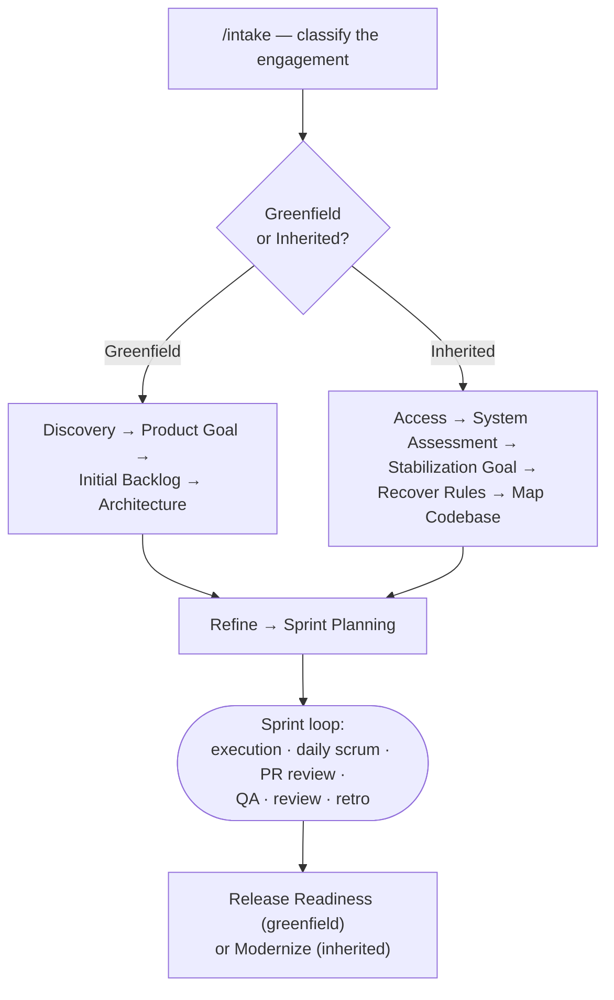

# 🧭 Using the AI-SDLC Playbook

A task-oriented guide to running the Playbook. It tells you *how to do X* and links to the
authoritative reference docs for the detail. New here? Start with **Getting Started**.

## 🗺️ Lifecycle at a glance

## 📚 Reference docs (the source of truth)
- [CLAUDE.md](../../CLAUDE.md) — operating manual: agents, commands, workflow.
- [playbook/PLAYBOOK.md](../../playbook/PLAYBOOK.md) — the full model.
- [playbook/mcp.md](../../playbook/mcp.md) — MCP integrations setup.

## 🛠️ For the delivery team
- [Getting Started](getting-started.md) — clone, configure MCP, classify, first run. [delivery]
- [Running an Engagement](running-an-engagement.md) — the run order, command + agent per step. [delivery]
- [Running a Sprint](running-a-sprint.md) — the recurring per-sprint command loop. [delivery]
- [Publishing to the ADO Wiki](publishing-to-ado-wiki.md) — sync this guide into the project wiki. [delivery]
- [Adding a Page](adding-a-page.md) — how to extend this guide. [delivery]

## 👥 For everyone / clients
- [Governance and Reviews](governance-and-reviews.md) — the human approval gates, DoR/DoD. [both]
- [For Clients](for-clients.md) — orientation for client stakeholders. [client]
