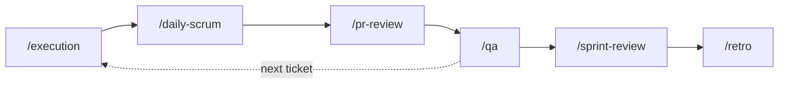

# 🔁 Running a Sprint

**Audience:** 🛠️ Delivery team

## Purpose
Drive the recurring per-sprint commands once an engagement is set up and planned.

## 🔁 The loop at a glance

## The recurring loop (both tracks)
Run these repeatedly, keyed by item id; they write item-keyed artifacts under
`src/<eng>/delivery/<activity>/` and append to the `## Activity log` in `engagement.md`:
- `/execution <eng> <ticket> [layer …]` — implement a ticket (orchestrates layer specialists).
- `/daily-scrum <eng> [date]` — daily standup summary.
- `/pr-review <eng> <pr>` — first-pass AI PR review.
- `/qa <eng> <story>` — test design for a story.

## Sprint boundaries
- The loop commands set `phase: execution` and a `sprint:` marker on first run. To start a new sprint, bump `sprint:` in `engagement.md`.
- Wrap-up: `/sprint-review <eng> [sprint]` → `/retro <eng> [sprint]`, then `/release-readiness` (greenfield) or `/modernize` (inherited).
- Cross-cutting anytime: `/security-review <eng> [target]` (does not change phase/sprint markers).

## Governance gates
Every artifact passes a human review gate — see [governance-and-reviews.md](governance-and-reviews.md).

## 📚 Read more
- Command reference and keying rules: [CLAUDE.md](../../CLAUDE.md) (Slash commands section)
- Where this sits in the engagement: [running-an-engagement.md](running-an-engagement.md)
