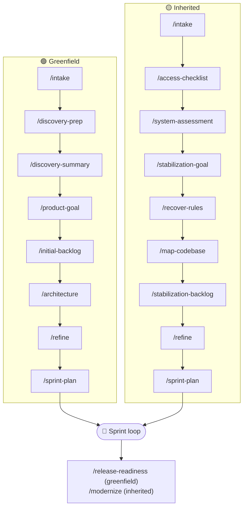

# 🗺️ Running an Engagement

**Audience:** 🛠️ Delivery team

## Purpose
Walk through the numbered run order for an engagement and show which command + agent drives each
step and where each artifact lands. The authoritative step sequence lives in PLAYBOOK.md; this page
is the operator's quick path.

## 🗺️ Run order at a glance

## Pick your track
- **Greenfield** (new build): steps 1–15.
- **Inherited** (takeover): steps 1–14.
See [greenfield-vs-inherited.md](../../playbook/greenfield-vs-inherited.md) to classify.

## How a step works
Each step maps to one slash command that orchestrates in the main conversation and delegates the
artifact to a mapped agent, writing it under `src/<engagement>/delivery/`. The command/agent/template
map per step is in [CLAUDE.md](../../CLAUDE.md) (run-order tables); the authoritative narrative is
[PLAYBOOK.md](../../playbook/PLAYBOOK.md) §5 (greenfield) and §6 (inherited).

## Greenfield path (commands in order)
`/intake` → `/discovery-prep` → `/discovery-summary` → `/product-goal` → `/initial-backlog` →
`/architecture` → `/refine` → `/sprint-plan` → then the per-sprint loop (see
[running-a-sprint.md](running-a-sprint.md)) → `/release-readiness`.

## Inherited path (commands in order)
`/intake` → `/access-checklist` → `/system-assessment` → `/stabilization-goal` → `/recover-rules` →
`/map-codebase` → `/stabilization-backlog` → `/refine` → `/sprint-plan` → then the per-sprint loop →
`/modernize`.

## Where artifacts go
- Linear setup/planning artifacts: `src/<engagement>/delivery/`.
- Recurring sprint artifacts: `src/<engagement>/delivery/<activity>/<item>.md`, with an `## Activity log` in `engagement.md`.
- Durable project docs and code: inside the cloned project repo at `src/<engagement>/<project-repo>/`.

## 📚 Read more
- Step-by-step tables: [CLAUDE.md](../../CLAUDE.md)
- Authoritative model: [PLAYBOOK.md](../../playbook/PLAYBOOK.md)
- The recurring loop: [running-a-sprint.md](running-a-sprint.md)
